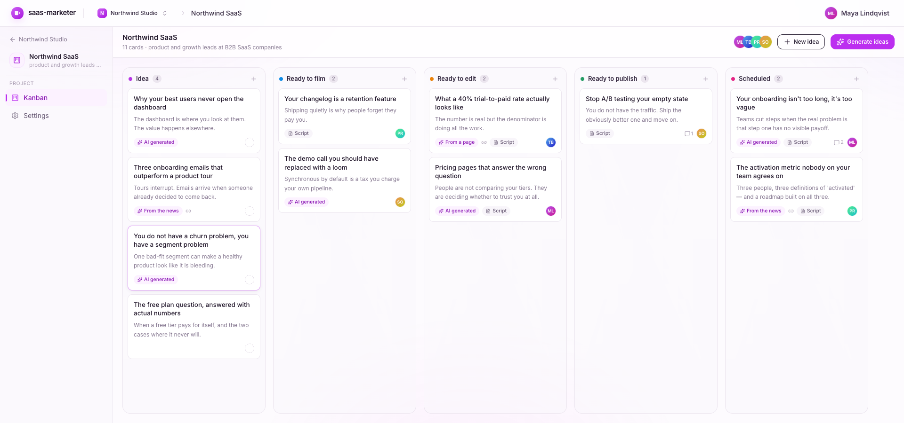
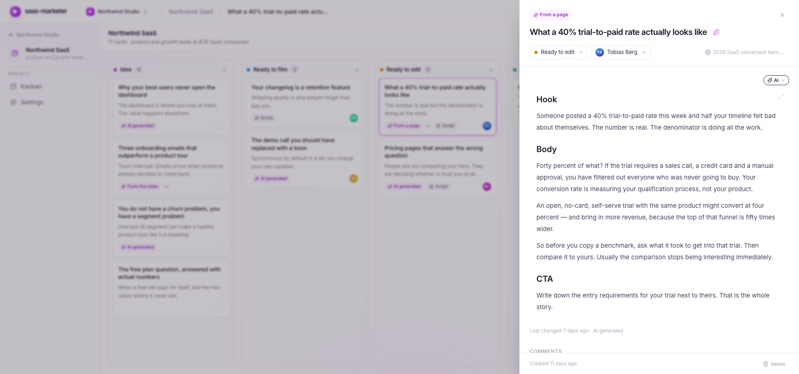
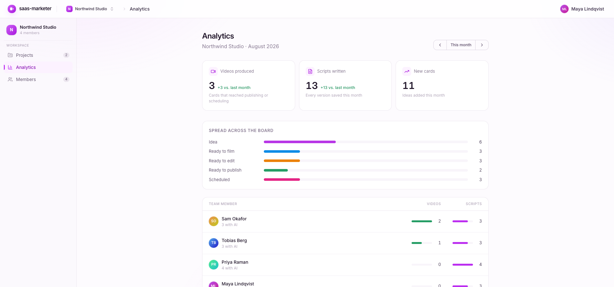
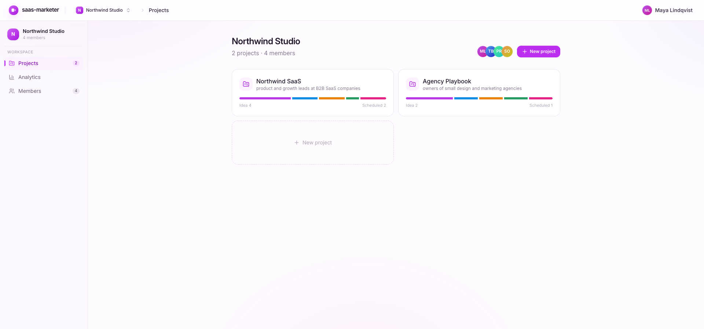
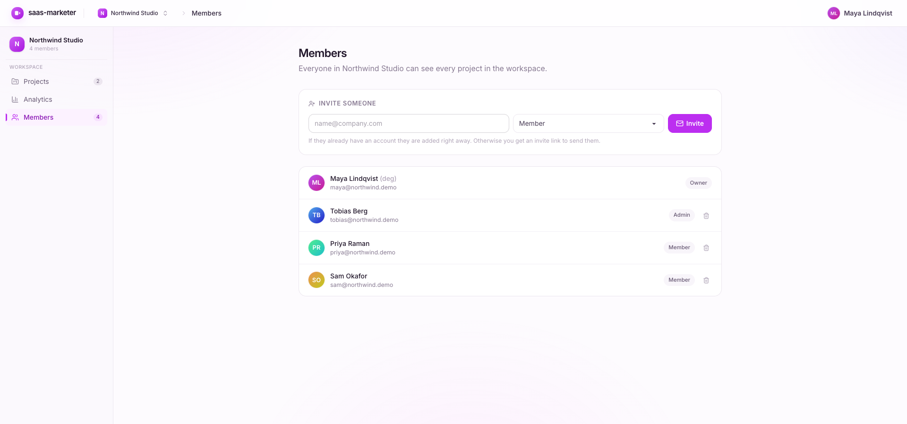
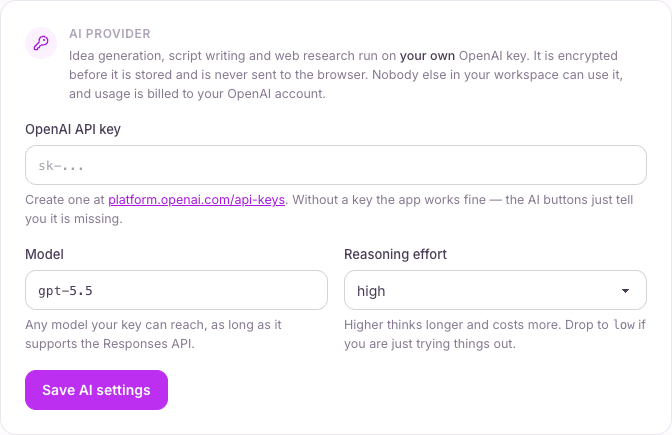
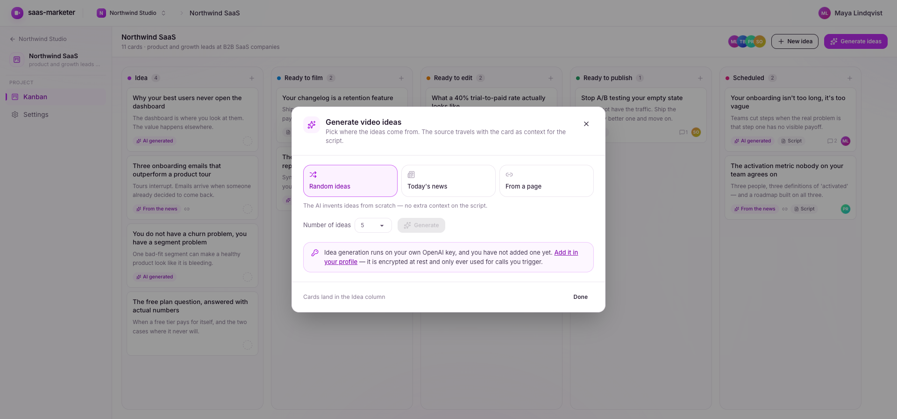

<div align="center">

# saas-marketer

**Jira, but for marketing video.** A kanban board where the AI does the research
and writes the scripts — grounded in today's news, an article you paste in, or
nothing at all.

Self-hosted. No accounts to buy, no seats to count, no telemetry.
You bring your own OpenAI key and pay OpenAI directly.

[Getting started](#getting-started) · [How it works](#how-it-works) · [Self-hosting](docs/self-hosting.md) · [Architecture](docs/architecture.md) · [Contributing](CONTRIBUTING.md)



</div>

---

## Why this exists

Marketing video production is a pipeline, but most teams run it out of a
spreadsheet and a shared drive. The idea lives in Slack, the script lives in a
Google Doc, the "is this filmed yet?" lives in someone's head, and the answer to
"how many did we ship last month?" lives nowhere at all.

This is that pipeline as an actual board — five columns from **idea** to
**scheduled** — with the two slowest steps handed to a model that can search the
web:

- **Coming up with ideas.** Ten titles from today's news in your niche, from an
  article you paste in, or from thin air. Each one attacks a different objection
  instead of being ten rewordings of the same sentence.
- **Writing the first draft.** The model searches, opens the pages, reads them,
  and writes a hook / body / CTA script in markdown. Then sharpens it on request.

Nothing in the app is tied to a vertical. Each project carries its own **niche**
and **description**, and every prompt is grounded in those — so the same install
works for a B2B SaaS, a dental clinic and a woodworking channel without a line of
code changing.

## What you get

| | |
| --- | --- |
| **A board built for video** | Five columns, drag and drop, positions that survive concurrent moves. Cards carry the angle, the source article, the assignee and the script. |
| **Ideas from real sources** | `web_search` finds today's stories in your niche and grounds every suggestion in one. The article rides along on the card as context for the script. |
| **Scripts in one click** | Markdown, written to a fixed hook/body/CTA structure, 130–200 words. Every version is kept in the revision history. |
| **A real editor** | tiptap with markdown round-tripping, plus a teleprompter view for when you actually film. |
| **Live collaboration** | Server-Sent Events. Every card change appears in every open tab, with a toast you can click through to the card. |
| **Analytics that count the right things** | Videos produced, scripts written and new ideas — per month, for the workspace and per team member. |
| **Teams and workspaces** | Invite links, roles (owner / admin / member), assignment, comments and a full activity history on every card. |

<table>
<tr>
<td width="50%"></td>
<td width="50%"></td>
</tr>
<tr>
<td align="center"><em>Every card is a script, a source and a history.</em></td>
<td align="center"><em>What actually shipped, per person, per month.</em></td>
</tr>
<tr>
<td width="50%"></td>
<td width="50%"></td>
</tr>
<tr>
<td align="center"><em>One workspace, many projects — each with its own niche.</em></td>
<td align="center"><em>Invite by email, three roles, no seat counting.</em></td>
</tr>
</table>

## Getting started

You need **Node 20+** and **Docker** (for the bundled Postgres). Nothing else.

```bash
git clone https://github.com/Johannett321/saas-marketer.git
cd saas-marketer
npm install
npm run dev
```

That's it — <http://localhost:5173>.

`npm run dev` writes a `.env` with a freshly generated `SESSION_SECRET`, starts
Postgres, waits for it, applies migrations and generates the Prisma client before
the dev server boots. Every step is idempotent, so the second run costs about a
second. If you would rather do the setup without starting the server, run
`npm run setup`.

**Already have a Postgres?** Point `DATABASE_URL` at it in `.env` and the setup
step leaves Docker alone entirely.

### Try it with demo data

```bash
npm run db:seed
```

Seeds a fictional workspace — two projects, 17 cards spread across the board,
scripts, comments and a few months of history so the analytics page has something
to draw. Sign in as `maya@northwind.demo` with the password `demo1234`.

Re-running it rebuilds that workspace from scratch and touches nothing else.

### Turning on the AI

The board, the editor, comments, analytics and live updates all work with no
configuration. The AI features need a key, and **each person adds their own**
under **Profile → AI provider**:

<div align="center">

</div>

Grab one from [platform.openai.com/api-keys](https://platform.openai.com/api-keys).
It is encrypted before it is stored, never sent to the browser, and only ever used
for calls that person triggers — so on a shared instance nobody spends anybody
else's credit. Until a key is set, the AI buttons say so instead of failing:

<div align="center">

</div>

There is deliberately **no instance-wide API key**. See
[docs/self-hosting.md](docs/self-hosting.md) for the reasoning and for how to run
this on a server.

## How it works

Three AI flows, all grounded in the project's own niche and description:

| Mode | What happens |
| --- | --- |
| **Random ideas** | The model invents titles from scratch. No source attached. |
| **Today's news** | `web_search` finds and reads today's stories in your niche. Every idea keeps the article it came from. |
| **From a page** | You paste a link. The app fetches the article, the model proposes different angles on it, and the article is stored on the card. |

When a script is generated, the card's stored source is used as the factual basis.
If the card has no source, the model searches the web and reads pages before it
writes. Scripts are markdown; every version lands in the revision history, which
is also what the analytics page counts.

Calls take tens of seconds at `high` reasoning effort, so they run in resource
routes rather than page loaders, and there is a small game to play while you wait.

## Commands

```bash
npm run dev         # set everything up, then start on :5173
npm run setup       # just the setup — .env, Postgres, migrations, client
npm run build       # production build
npm start           # serve the build
npm run typecheck   # react-router typegen && tsc — the automated check in this repo

npm run db:seed     # (re)build the demo workspace
npm run db:migrate  # create a migration after changing prisma/schema.prisma
npm run db:studio   # Prisma Studio
npm run db:reset    # drop everything and re-apply migrations
npm run db:down     # stop the Postgres container
```

## Stack

- **[React Router v8](https://reactrouter.com)** in framework mode, SSR on
- **PostgreSQL** via **[Prisma 7](https://prisma.io)** with the `@prisma/adapter-pg` driver adapter
- **[Tailwind v4](https://tailwindcss.com) + [daisyUI 5](https://daisyui.com)**, custom theme
- **[tiptap](https://tiptap.dev)** for the script editor, markdown in and out
- **react-dnd** for the board, **Server-Sent Events** for live updates
- **OpenAI Responses API** with the `web_search` tool

## Privacy

Worth stating plainly, because it is unusual:

- **No analytics, no telemetry, no tracking.** No PostHog, no Google Analytics, no
  Sentry, no third-party scripts of any kind. The app makes no network calls
  except to your database, to OpenAI, and to article URLs you explicitly paste in.
- **No payments.** There is no billing code, no plans and no limits. Every feature
  is available to every user of every install.
- **Your key stays yours.** API keys are encrypted at rest with AES-256-GCM and
  never leave the server.

## Contributing

Issues and pull requests are welcome — see [CONTRIBUTING.md](CONTRIBUTING.md) for
the layout of the codebase and the handful of conventions that will bite you if
you miss them (activity has one write path, card moves have one write path, and
adding an `ActivityType` takes four edits).

## License

[MIT](LICENSE).
